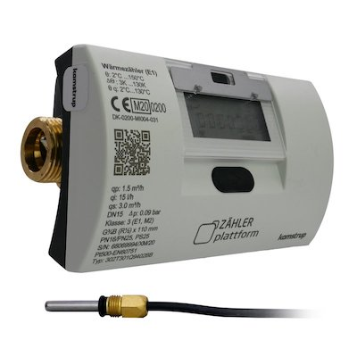

# M-Bus based Kamstrup Python exporter
This repository contains the instructions on how to build the infrastructure to collect data about the usage of electricity and make these data available to [Prometheus](https://prometheus.io/) time series database.

This software is a modified version of the [M-Bus based power meter Python exporter](https://github.com/zajdee/prometheus-mbus-exporter) by Radek Zajic.

## Hardware installation
This module was developed for and tested with the [Kamstrup MULTICAL 303 heat meter]. This meter device provides a simple [M-Bus](https://en.wikipedia.org/wiki/Meter-Bus) based interface to read the usage data.



The MULTICAL 303 is hooked up to a simple [USB to MBUS Master Module](https://www.aliexpress.us/item/3256804353865274.html). Make sure to order the Master version. The Slave versions are much cheaper but can only read datagrams already on the wire. The Master version can send requests as is required here.

You can obviously use any M-Bus-to-serial and serial-to-USB adapter you want, this is just a confirmed working one.

## Software installation
1. Create a new directory, for example`/opt/mbus_meter` and clone this repo to it.
2. Build and install `libmbus` to get the `mbus-serial-request-data` binary.
   1. Install build dependencies (Debian): `apt-get -y install build-essential devscripts`
   2. Clone the `libmbus` repo: `https://github.com/rscada/libmbus`
   3. Build Debian package: `cd libmbus && ./build-deb.sh`
   4. Install the built package (Debian), which is in the directory parent to the one where the package is built, e.g. `dpkg -i ../libmbus1_0.8.0_arm64.deb`
3. Install Python requirements for this tool. Run `pip3 install -m requirements.txt`.
   1. If you are a more advanced Python user, you can of course use a [Python virtual environment](https://packaging.python.org/guides/installing-using-pip-and-virtual-environments/)
   2. If you wish the exporter to listen on IPv6 sockets (for example to use `address: '::'` in the `.yml` config file), upgrade the `prometheus_client` library to version `0.8.0` or newer by running `pip3 install --upgrade prometheus_client>=0.8.0`, then manually patch `exposition.py` according to [Issue #567](https://github.com/prometheus/client_python/issues/567) bug report on GitHub.
4. Create unique and stable symlink to the serial port device.
   1. Edit and deploy `10-usbports.rules` to `/etc/udev/rules.d/` to create the `/dev/ttymeterBus` symlink to the real serial device.
   2. Update your `initramfs`, e.g. by running `update-initramfs -k all -u`.
   3. Reboot for the symlink to get created.
5. Configure the exporter
   1. Copy `prometheus-mbus-exporter.yml.example` to `prometheus-mbus-exporter.yml`
   2. Edit baud rate, meter ID, serial port name, metrics webserver TCP port, and location.
   3. The default baud rate is `2400`, default meter ID is zero (`0`); both can be changed via the meter user interface.
6. Configure `systemd`
   1. Deploy `power_meter_prometheus_exporter.service` to `/etc/systemd/system/`
   2. Run `systemctl daemon-reload && systemctl enable power_meter_prometheus.service && systemctl start power_meter_prometheus.service`
7. Call `curl http://localhost:<port-number>/metrics` and observe the counters
8. Configure your Prometheus instance to collect the data from the exporter endpoint. 

## Live metrics example

```
# HELP kamstrump_energy_kwh_total Energy in kWh
# TYPE kamstrump_energy_kwh_total counter
kamstrump_energy_kwh_total{location="YourLocation"} 1160.0
# HELP kamstrump_volume_m3_total Volume in m^3
# TYPE kamstrump_volume_m3_total counter
kamstrump_volume_m3_total{location="YourLocation"} 104.19
# HELP kamstrump_on_time_hours_total On time in hours
# TYPE kamstrump_on_time_hours_total counter
kamstrump_on_time_hours_total{location="YourLocation"} 1087.0
# HELP kamstrup_temperature_celcius Temperature in Celsius
# TYPE kamstrup_temperature_celcius gauge
kamstrup_temperature_celcius{location="YourLocation",type="flow"} 59.26
# HELP kamstrup_temperature_celcius Temperature in Celsius
# TYPE kamstrup_temperature_celcius gauge
kamstrup_temperature_celcius{location="YourLocation",type="return"} 38.31
# HELP kamstrup_temperature_celcius Temperature in Celsius
# TYPE kamstrup_temperature_celcius gauge
kamstrup_temperature_celcius{location="YourLocation",type="difference"} 20.95
# HELP kamstrump_power_w Power in W
# TYPE kamstrump_power_w gauge
kamstrump_power_w{location="YourLocation"} 8200.0
# HELP kamstrump_volume_flow_l_h Volume flow in l/h
# TYPE kamstrump_volume_flow_l_h gauge
kamstrump_volume_flow_l_h{location="YourLocation"} 340.0
```

## Copyright and permission notice

Copyright (c) 2019 - 2020, Radek Zajic, radek@zajic.v.pytli.cz.  
Copyright (c) 2023, Richard van den Berg, richard@vdberg.org.

All rights reserved.

Permission to use, copy, modify, and distribute this software for any purpose with or without fee is hereby granted, provided that the above copyright notice and this permission notice appear in all copies.

THE SOFTWARE IS PROVIDED "AS IS", WITHOUT WARRANTY OF ANY KIND, EXPRESS OR IMPLIED, INCLUDING BUT NOT LIMITED TO THE WARRANTIES OF MERCHANTABILITY, FITNESS FOR A PARTICULAR PURPOSE AND NONINFRINGEMENT OF THIRD PARTY RIGHTS. IN NO EVENT SHALL THE AUTHORS OR COPYRIGHT HOLDERS BE LIABLE FOR ANY CLAIM, DAMAGES OR OTHER LIABILITY, WHETHER IN AN ACTION OF CONTRACT, TORT OR OTHERWISE, ARISING FROM, OUT OF OR IN CONNECTION WITH THE SOFTWARE OR THE USE OR OTHER DEALINGS IN THE SOFTWARE.

Except as contained in this notice, the name of a copyright holder shall not be used in advertising or otherwise to promote the sale, use or other dealings in this Software without prior written authorization of the copyright holder.

[Kamstrup MULTICAL 303 heat meter]:https://www.kamstrup.com/en-en/heat-solutions/meters-devices/meters/multical-303/documents
